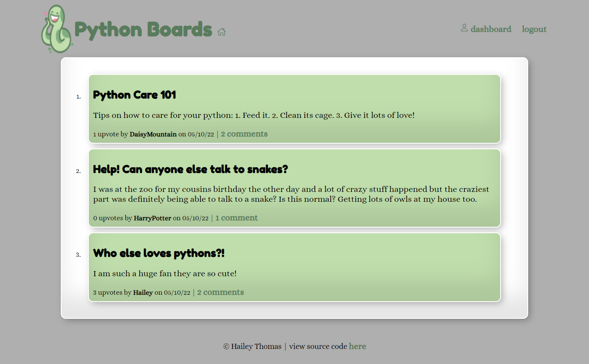
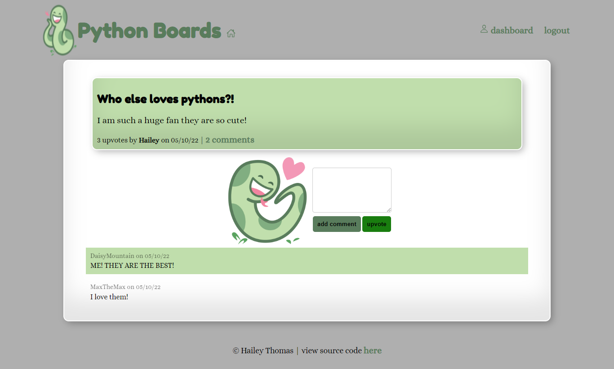
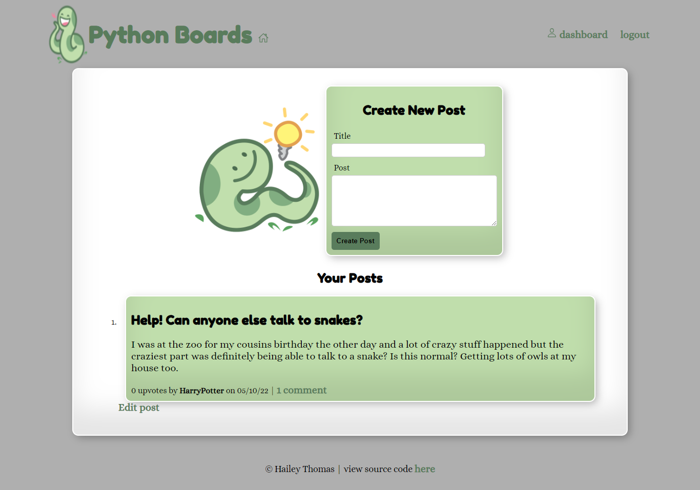
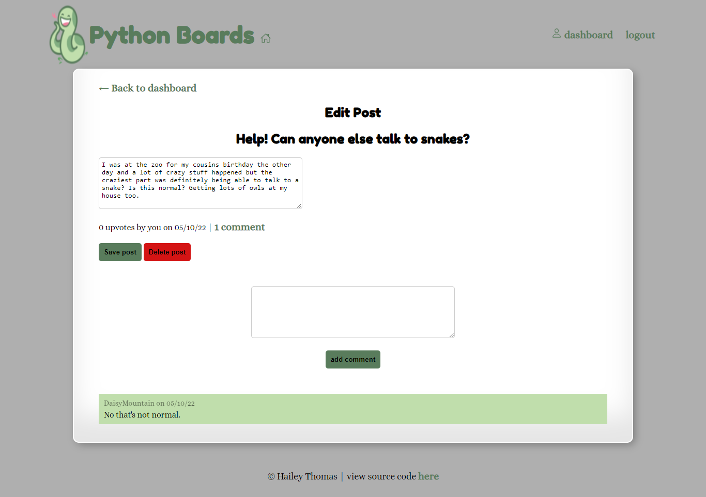

# Python Boards 🐍

## Description

Python Boards is a basic CRUD application where users can sign up and create, update and delete posts. They can also comment and upvote posts. Powered by Python, Flask and SQLAlchemy.

## Table of Contents

- [Usage](#usage)
- [Credits](#credits)
- [License](#license)

## Usage

Visit the deployed link below and view posts already created. Click the login button to either login or sign up. You are then taken to your dashboard where you can create a post or visit the homepage to interact with other posts. You can also access your posts on your dashboard where you can edit and delete them.

### Screenshot

### Links

- [DeployedLink](https://python-boards.herokuapp.com/) - link to deployed website
- [GitHub](https://github.com/HaileyThomas/python-boards) - link to GitHub project

## Credits

Created with Python, Flask, SQLAlchemy, bcrypt and CSS.

## License

[License](https://opensource.org/licenses/MIT) - link to license

MIT License

Copyright (c) [2022] [Hailey Thomas]

Permission is hereby granted, free of charge, to any person obtaining a copy
of this software and associated documentation files (the "Software"), to deal
in the Software without restriction, including without limitation the rights
to use, copy, modify, merge, publish, distribute, sublicense, and/or sell
copies of the Software, and to permit persons to whom the Software is
furnished to do so, subject to the following conditions:

The above copyright notice and this permission notice shall be included in all
copies or substantial portions of the Software.

THE SOFTWARE IS PROVIDED "AS IS", WITHOUT WARRANTY OF ANY KIND, EXPRESS OR
IMPLIED, INCLUDING BUT NOT LIMITED TO THE WARRANTIES OF MERCHANTABILITY,
FITNESS FOR A PARTICULAR PURPOSE AND NONINFRINGEMENT. IN NO EVENT SHALL THE
AUTHORS OR COPYRIGHT HOLDERS BE LIABLE FOR ANY CLAIM, DAMAGES OR OTHER
LIABILITY, WHETHER IN AN ACTION OF CONTRACT, TORT OR OTHERWISE, ARISING FROM,
OUT OF OR IN CONNECTION WITH THE SOFTWARE OR THE USE OR OTHER DEALINGS IN THE
SOFTWARE.

## Questions

For any questions please feel free to contact me below!

### Contact

- [Email](mailto:haileyraethomas@gmail.com) - Email Hailey Thomas : haileyraethomas@gmail.com
- [GitHub](https://github.com/HaileyThomas) - GitHub username : HaileyThomas
